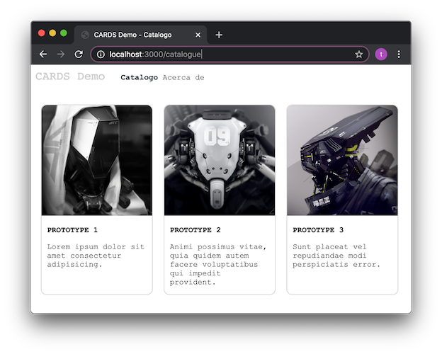

## Vista Previa



# CARDS DEMO, BackEnd.


> 'javascript', 'express', 'nodejs', 'axios', fvvelasquez


Servidor API REST express que sirve un catalogo de CARDS desde un db.json con axios y JS.
Separamos las responsabilidades del código en capas, tipo MVC.


### API ENDPOINTS:

#### GET: "/catalogue", "/"

Sirve un html que muestra un CATÁLOGO en forma de CARDS.
Usa: Petición GET "/catalogue/all" generada con 'axios' desde el Navegador Web.

#### GET: "/catalogue/all",

Sirve una serie de registros {} almacenados en un archivo 'db.json' [] del lado del Servidor.

#### GET: "/about"

Sirve un html que muestra una 'about page'.


## Instalación

Instalar dependencias del proyecto:

```bash
npm install
```

## Uso

Consola, levantar servicio:

```bash
npm start
```

Navegador:

```bash
http://localhost:3000
```

